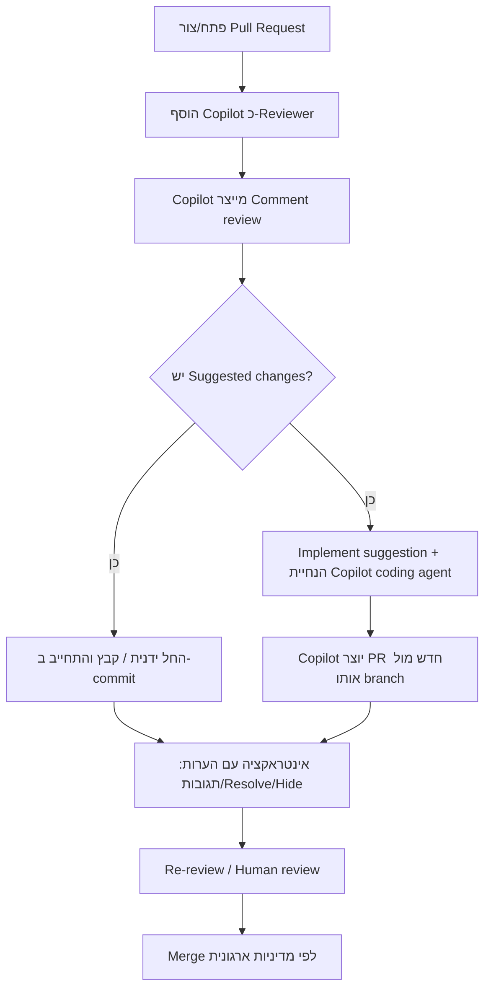

# דוח מחקר מעמיק: "Use code review" ב‑GitHub Copilot Agents

## תקציר מנהלים

דף התיעוד **"Use code review"** מתאר כיצד להפעיל סקירת קוד באמצעות GitHub Copilot במספר ממשקים:
- באתר GitHub (כ‑Reviewer ב‑Pull Request)
- ב‑Visual Studio Code (סקירה של Selection או כל השינויים שלא בוצע להם commit)
- ב‑JetBrains IDEs
- ב‑Visual Studio
- ב‑Xcode
- ב‑GitHub Mobile

הדף מדגיש שסקירת Copilot משאירה תמיד Review מסוג **Comment** בלבד (לא Approve / Request changes), ולכן אינה נספרת לאישורים נדרשים ואינה חוסמת מיזוג.

לפי המסמכים הרשמיים של GitHub, בעת בקשת סקירה Copilot מרכיב Prompt מתוך ה‑diff יחד עם הקשר נוסף (כמו כותרת ותיאור PR) והנחיות מותאמות (Custom instructions), ושולח אותו למודל שפה גדול. לכן איכות ה‑PR description וה‑Custom instructions משפיעה ישירות על איכות הביקורת.

מבחינת עלויות: כל סקירה (ב‑PR או ב‑IDE) צורכת **Premium request** אחד.

---

## פירוק אופרטיבי של דף "Use code review"

### סקירה באתר GitHub על Pull Request
1. נכנסים ל‑PR קיים או יוצרים PR חדש.
2. פותחים את תפריט **Reviewers** ובוחרים **Copilot**.
3. ממתינים לתוצאות (בדרך כלל פחות מ‑30 שניות).
4. קוראים את ההערות בטיימליין של ה‑PR.
5. מתייחסים להערות כמו להערות Reviewer אנושי: reply, reaction, resolve, hide.

> תזכורת קריטית: Copilot תמיד משאיר Comment review בלבד ולכן לא נספר ל‑Required approvals ולא חוסם merge.

### עבודה עם Suggested changes + Copilot coding agent
- קבלת Suggested changes ידנית (יחיד/קבוצה) ואז commit.
- או לחיצה על **Implement suggestion** על הערת סקירה:
  - נוצרת טיוטת תגובה (draft comment) להנחיית Copilot.
  - Copilot מייצר PR חדש כנגד אותו branch עם התיקונים.

### VS Code
- **Review Selection** דרך Copilot Menu.
- **Review Uncommitted Changes** דרך Copilot Menu.
- ליישום הצעה: **Apply and Go To Next** (ללא commit אוטומטי).

### JetBrains IDEs
`Tools → GitHub Copilot → Review current changes with GitHub Copilot`

### Visual Studio
ב‑Git Changes לוחצים:
`Review changes with Copilot`

### Xcode
1. `Editor → GitHub Copilot → Open Chat`
2. לחיצה על כפתור **Code Review** בחלון הצ'אט.

### GitHub Mobile
1. פתיחת PR
2. גלילה ל‑Reviews והרחבה
3. `Request Reviews` → הוספת Copilot → `Done`

---

## תרשים זרימה (PR Path)



---

## דרישות מקדימות, הרשאות והגדרות

### זכאות ותוכניות
- Copilot code review זמין בתוכניות Copilot Pro, Pro+, Business, Enterprise.
- ב‑Copilot Free יכולת code review מוגבלת (למשל Review selection ב‑VS Code).

### מדיניות ארגונית ו‑Preview
- בארגון יש תלות במדיניות Copilot להפעלת code review.
- יש יכולות preview שדורשות Opt‑in (AI Controls / Copilot in GitHub.com).
- על שימוש ב‑preview חלים תנאי Pre‑release License Terms.

### סקירות אוטומטיות
שלוש רמות:
1. ברמת המשתמש (PRs שאתה יוצר).
2. ברמת ריפו (Rulesets).
3. ברמת ארגון (Rulesets עם Include/Exclude patterns).

### Custom instructions
- Repository‑wide: `.github/copilot-instructions.md`
- Path‑specific: `.github/instructions/*.instructions.md` עם `applyTo`.
- ניתן להחריג agent מסוים עם `excludeAgent: "code-review"`.
- קיימת תמיכה גם בהוראות Agent בקבצי `AGENTS.md` (עם קדימות לפי עומק נתיב).

---

## מגבלות, אבטחה ופרטיות

### מגבלות תפקודיות
- Comment review בלבד (לא מאשר ולא חוסם).
- ייתכנו false positives / החמצות / הצעות לא מאובטחות.
- נדרשת סקירה אנושית משלימה.
- אין Model switching ב‑Copilot code review.

### קבצים שלא נבדקים
- קבצים/נתיבים מוחרגים מראש (למשל lock files, `*.svg`, `node_modules`, `vendor`, `generated`).
- Content exclusion policy מונעת סקירה של קבצים מושפעים.

### שיקולי פרטיות
- הפרומפט כולל diff + הקשר PR + instructions.
- Content exclusion יכול להיות מוגדר ע"י Repo admins / Org owners / Enterprise owners.
- יש מגבלות (למשל חשיפה סמנטית עקיפה דרך IDE, symlinks, remote filesystem).

---

## חיוב ועלויות

- כל Copilot code review צורך Premium request אחד.
- האיפוס מתבצע חודשית (UTC).
- Copilot Free כולל 50 Premium requests לחודש.
- בתוכניות בתשלום יש מכסות גבוהות יותר ואפשרות לרכישת requests נוספים.
- בסקירה אוטומטית לכל PR חדש, הצריכה מיוחסת למגיש ה‑PR.

---

## השוואה בין מסמכי תיעוד רשמיים (תקציר)

| מסמך | מיקוד | הערה מרכזית |
|---|---|---|
| Use code review | הפעלה מעשית בכלים שונים | סקירה תמיד מסוג Comment |
| About Copilot code review | קונספט, מגבלות, runners | תלות במדיניות ותמיכת סביבה |
| Configure automatic review | אוטומציה ברמת משתמש/ריפו/ארגון | שימוש Premium מיוחס למגיש PR |
| Content exclusion | החרגות תוכן | קבצים מושפעים לא נסקרים |
| Requests in Copilot | מודל חיוב Premium | כל סקירה = Premium request אחד |
| Plans for Copilot | מטריצת יכולות לפי תוכנית | ב‑Free יש מגבלות יכולת |
| Responsible use | סיכונים והנחיות איכות | חובה לשלב review אנושי |

---

## תבניות שימוש מוכנות בעברית

### 1) VS Code Prompt file: `/review-code`
```bash
/review-code focus=security
```
או:
```bash
/review-code focus=אימות קלט, הרשאות, סודות בקוד, ו-OWASP Top 10 רלוונטי
```

### 2) תבנית PR description
```md
מטרה
- מה הבעיה/הפיצ'ר ולמה עכשיו?

שינויי מפתח
- (3–7 נקודות) מה השתנה ומה נשאר אותו דבר

הקשר טכני
- API/DB/קונפיג מושפעים
- הנחות/תלויות (flags, env vars, migrations)

סיכוני רגרסיה
- אזורים רגישים
- מה לא כוסה ב-PR זה

בדיקות
- Unit:
- Integration/E2E:
- Manual:

בקשות Reviewer
- התמקדו במיוחד ב: [אימות קלט | הרשאות | ביצועים | תאימות לאחור | שגיאות]
```

### 3) תבנית Implement suggestion ל‑Copilot coding agent
```text
יישם את ההצעה בהערת הסקירה הזו, אבל:
1) אל תשנה התנהגות API חיצונית ללא עדכון תיעוד/בדיקות.
2) הוסף/עדכן בדיקות יחידה שמוכיחות שהבאג תוקן.
3) שמור על סגנון קוד קיים ואל תבצע refactor לא קשור.
4) אם יש כמה דרכי תיקון — בחר הפשוטה ביותר והסבר למה.
```

### 4) תבנית `.github/copilot-instructions.md`
```md
## כללי סקירה והמלצות שינוי
- תן עדיפות לתיקונים שמוסיפים/מחדדים בדיקות יחידה.
- אל תציע פתרונות שמוסיפים סודות לקוד/לוגים.
- לכל הערה: ציין השלכה (אבטחה/ביצועים/תחזוקה) והצע תיקון קונקרטי.
- אם מדובר בשינוי API/DB, הדגש תאימות לאחור והצע צעדי מיגרציה.
```

---

## המלצות לשיפור דף "Use code review"

1. להוסיף סעיף קצר של עלויות/תקרות בתחילת הדף.
2. להוסיף Troubleshooting לתרחישים נפוצים (Copilot לא מופיע, סקירה חלקית וכו').
3. לקשר בצורה מודגשת למדיניות Preview / AI Controls.
4. להבהיר תלות מינימלית להפעלת Copilot coding agent סביב Implement suggestion.
5. לשלב בדף תקציר ברור של "מה נשלח למודל" (diff + PR context + instructions).
